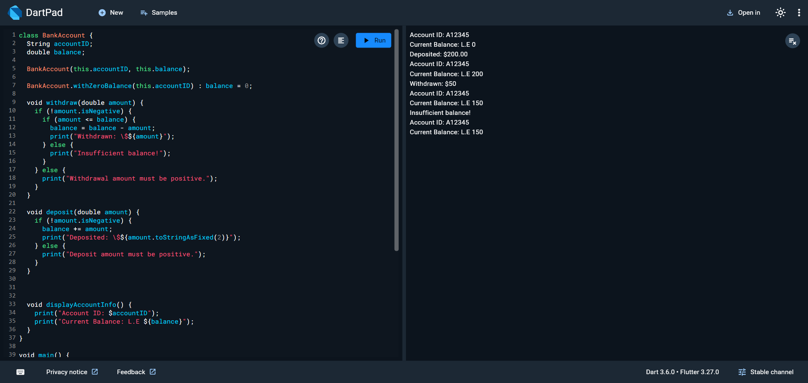

# BankAccount 

## Description
This project demonstrates how to create and manage a simple **BankAccount** class in Dart. It covers basic operations such as depositing and withdrawing money, and displaying account details.

## How to Run
1. Clone the repository or copy the `main.dart` file to your local system.
2. Navigate to the project directory in your terminal.
3. Run the program using the following command:
   ```bash
   dart run main.dart

   
## Example Output



## Features

- **Create a Bank Account**
- **Deposit Money**
- **Withdraw Money**
- **Display Account Info**
